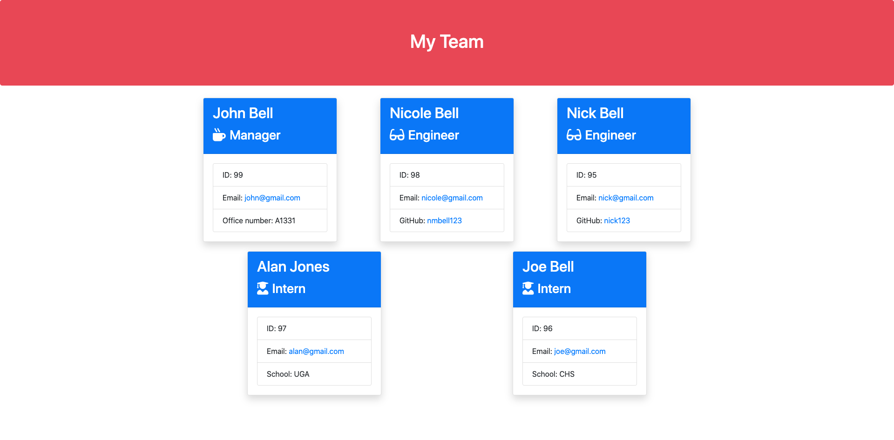
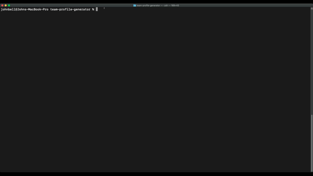

# Team Profile Generator

 [](https://github.com/jdbell123/team-profile-generator/issues)
 [](https://github.com/jdbell123/team-profile-generator/stargazers)
## Table of Contents

* [Reason](#reason)
* [Learnt](#learnt)
* [Take-Aways](#Take-Aways)
* [Installation](#installation)
* [Usage](#usage)
* [Testing](#testing)
* [Credits](#credits)
* [License](#license)
* [Links](#links)

***

## Reason

The reason for this assignment this week was to continue to learn node.js logic and be introduced to automated testing. We were given the following User Story and Acceptance Criteria:

```
AS A manager
I WANT to generate a webpage that displays my team's basic info
SO THAT I have quick access to their emails and GitHub profiles
```

```
GIVEN a command-line application that accepts user input
WHEN I am prompted for my team members and their information
THEN an HTML file is generated that displays a nicely formatted team roster based on user input
WHEN I click on an email address in the HTML
THEN my default email program opens and populates the TO field of the email with the address
WHEN I click on the GitHub username
THEN that GitHub profile opens in a new tab
WHEN I start the application
THEN I am prompted to enter the team manager’s name, employee ID, email address, and office number
WHEN I enter the team manager’s name, employee ID, email address, and office number
THEN I am presented with a menu with the option to add an engineer or an intern or to finish building my team
WHEN I select the engineer option
THEN I am prompted to enter the engineer’s name, ID, email, and GitHub username, and I am taken back to the menu
WHEN I select the intern option
THEN I am prompted to enter the intern’s name, ID, email, and school, and I am taken back to the menu
WHEN I decide to finish building my team
THEN I exit the application, and the HTML is generated
```

---

## Learnt

Working on this project I have learnt about the following things:

    1 - Expanded knowledge on node.js
    2 - Learn how to write and execute test cases
    3 - Expanded knowledge on JavaScript

---

## Take-Aways

While I enjoyed this weeks homework it was one of the more tougher ones. Planning I feel is a key thing I am taking away from this weeks homework and also keep it simple and to the point. I think building the test cases first is a good approach as well to know.

---

## Installation

This is a node.js command line application and therefore the following is how to install the application:

```
npm i

```

---

## Usage 

To use this application type the following command into your terminal/command prompt (after installing it):

```
node index.js

```

This is a demo of the finished application:


This is the generated HTML page for the data entered in the demo above:



---

## Testing 

To test this application use the following command:

```
npm test

```

Here is a demo of the tests being run on this application:



---
## Credits

As always thanks to my BFF Google for being there in my hours of need. Also, to my fellow class mates for the study groups and hints/tips I received on this project. Last but not least a thank you to the tutor and TAs for the guidance and support they gave on this project. 

---

## License


Licensed under the [MIT](./LICENSE) license.


---

## Links

[GitHub Repo](https://github.com/jdbell123/team-profile-generator)